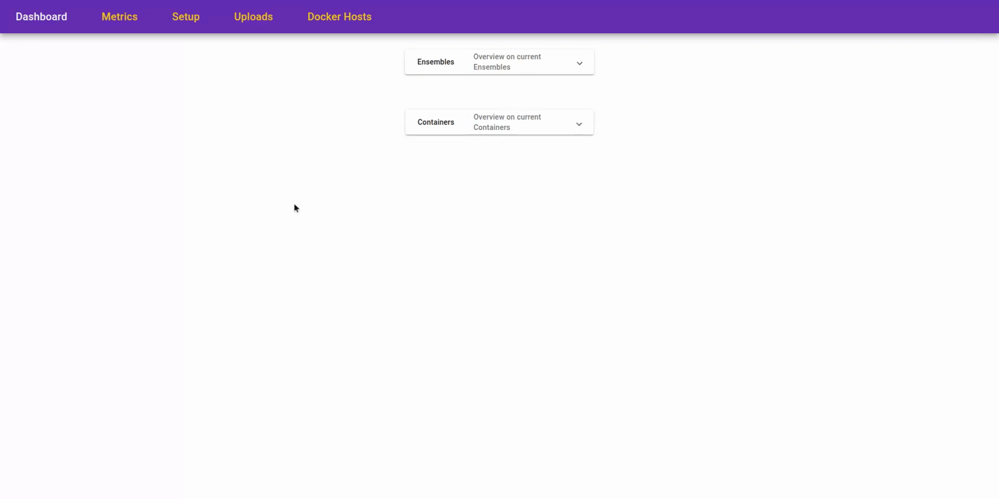

<div align="center">


</div>
<br>
<div align="center">
<a href="https://bicep.readthedocs.io/en/latest/"><i><u>View Docs</i></u></a>
<br>
<br>


</div>

## About The Project

BICEP presents an evaluation platform to benchmark arbitrary IDS solutions like Suricata, Snort, Zeek or Slips, in order to achieve comparability amongst IDS tools and novel apporaches. Practically every (D)IDS or (C)IDS can be added to the system via its plugin capability. 

Currently only Suricata and Slips modules are implemented and supported in terms of setup, configuration, lifecycle management and benchmarking.

The project is still under development and breaking changes are likely to occur. 

## Initialize Project

In order to be able to start the project you will need to initialize it first. Do this by running:

```
git submodule update --init --recursive
```
This fetches the newest version of the submodule for the backend code and is necessary for the application to work seamlessly.

## Start The Project

The project can be started by running running ```docker compose --env-file environments/env up```. This will spin up all containers in development mode. To run the stack in production mode, simply use the production env file like so: ```docker compose --env-file environments/prod up```

### Differences Between Production and Development Mode
The main difference between the two modes is how the Frontend connects to the backend. In development mode, it tries to reach out via "localhost". In Production mode, it uses the host name property to reach out to the services. This allows an user to connect to the fronten remotely i.e. BICEP can be deployed on a remote machine. If Porduction mode has not been enabled in such a setup, the frontend tries to reach the backend services on the localhost of the client, which is false. 
The development mode is assumed as default. 

> [!Warning]
> Please not that the production mode currently does not support a distributed setup of the system, i.e. the different services of BICEP NEED to run on the same machine.

## How to Use The Porject



### First Use Of The Project

> [!Important]
> If you run the framework in a new environment, please refere to the section [Add Nodes](#add-a-node), in order to be able to spin up containers on your localhost system

To use the systems already included, you can navigate to http://localhost:3000 after the startup has completed. Generally you will have to follow these steps to setup and benchmark a system:

1. Upload your configuration (rulesets and general configurations) for the system you want to deploy

2. Deploy the system using the Web GUI

3. Start either a live or a static analysis (for the latter you will need to upload a dataset to the application as explained in this [section](#supported-datasets) )

4. Aggregate your results in the embedded Grafana dashboard


## Supported Datasets

In general every type of dataset is support as long as it fulfills the following requirements:

1. It needs to be split into a pcap file containing the requests and a CSV file containing labels for each request

2. The requests from the pcap need to be assignable to the CSV rows, therefor the following needs to be assured:

    - In the CSV file, there must be a column named "Label" or "Class". which contains the keyowrd "benign" for each benign request. Malicious requests might be labled as desired
    - The following Columns need to be present as well
        - Time/Timestamp: containing a timestamp as exact as possible which corresponds to the one in the pcap file for the request
        - Source IP: Source IP of the request
        - Source Port: Source Port of the request
        - Destination IP: Destination IP of the request
        - Destination Port: Destination port of the request


## Add Your Own IDS
The list of already registered systems is available in the README [here](https://github.com/maldwg/BICEP-utils/tree/main)

To add your own IDS to the framework, you will need to provide the following in a docker image:
- Your system (executable via CLI) and all its dependencies
- [BICEP_Utils](https://github.com/maldwg/BICEP-utils/tree/main) should be added as submodule as it contains the fastapi server for the IDS as well as class definitions on Alerts and Base classes. 
- The implementation of the base classes for the AlertParser and the IDSBase from the Bicep_Utils repository. 
- a main.py that starts the fastAPI server, as can be seen in the example of [suricata](https://github.com/maldwg/BICEP-suricata-image/blob/main/bicep-suricata/src/main.py) or [slips](https://github.com/maldwg/BICEP-slips-image/blob/main/bicep-slips/src/main.py) or [snort](https://github.com/maldwg/BICEP-snort-image/blob/main/bicep-snort/src/main.py) .
For inspiration and sample implentations, have a look at the modules for [Sruciata](https://github.com/maldwg/BICEP-suricata-image) and [Slips](https://github.com/maldwg/BICEP-slips-image). The modules to implement can be found in [BICEPs-utils](https://github.com/maldwg/BICEP-utils/tree/main)

At the current state, a new IDS needs to be introduced to the DB of BICEP. Either add id by modifying the Database or the sql script providing the default entries. A feature is planned that automatically checks for available BICEP models so that this step is not necessary anymore.

### Tests 

In the BICEP_Utils repository under ```tests/ids_plugin_test_templates``` are some templated tests that you can build on and extend. Your resulting IDS should be able to satisfy these and provide the necessary capabilities of the Base classes IDSBase and ParserBase


## Add A Node
To be able to add a new node or to run the framework on a new machine, the docker environment needs adaptation.
In your docker config in `/etc/systemd/system/docker.service.d/docker.conf` add the following lines: 

```
[Service]
ExecStart=
ExecStart=/usr/bin/dockerd -H tcp://0.0.0.0:2375 -H unix:///var/run/docker.sock
```

This will allow external services like the core to access the Docker daemon remotely. 
Afterwards run:
```
sudo systemctl daemon-reload
sudo systemctl restart docker.service
```
