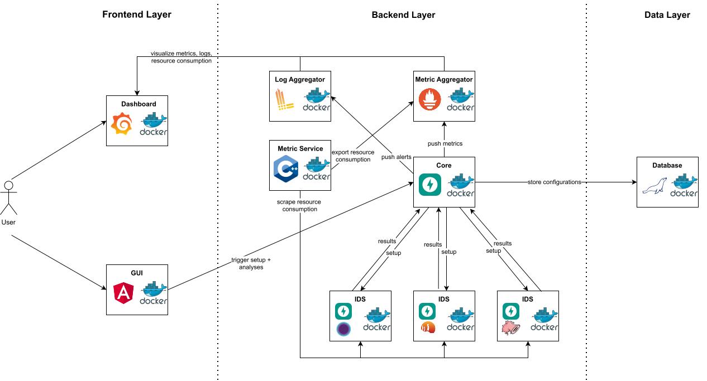

Architecture
============

As can be seen, the system features a 3-tier architecture approach, consisting of a frontend, backend, and data layer. Each component in these layers is containerized to ensure portability. The frontend consists of an Angular component to allow users to set up, configure, and benchmark different \ac{IDS} solutions. To visualize the results, Grafana is used to create dashboards and overviews, displaying alert-logs and the obtained metrics after an analysis. The backend is handled via a centralized component running a FastAPI web server. By receiving REST requests from the frontend, the Core either creates new containers running the \ac{IDS} specified or propagates the request to an existing instance. In addition to the \ac{IDS} itself, these \ac{IDS} containers also feature a FastAPI server to allow RESTful communication with the Core. To store configurations like rulesets or setup properties and datasets, MariaDB is used. To aggregate the results and be able to inject them into Grafana, both a Prometheus and a Loki instance are required. When analyses and metrics are collected, the respective results are sent from the \ac{IDS} container to the Core and then propagated to Prometheus for metrics and Loki for logs. \\
Thus, the solution offers a reproducible and portable deployment method by harnessing containers. Furthermore, the architecture includes tools that allow for the implementation of the requirements. A deeper introduction and reasons for selecting each tool involved are given in section \ref{tools-used}.

\subsection{Common Communication Standard}
\label{common-communication-standard}
As the architecture depiction in figure \ref{fig:high-level-architecture} implies, different \acp{IDS} send their results to the Core. This central component then handles the combination and evaluation. However, different \acp{IDS} offer different alert formats. Therefore, it is necessary to convert each result set into a common standard to allow the Core to analyse them indifferently. To accomplish this, either the Core needs to convert each result or the \ac{IDS} containers need to adjust their formats accordingly. The latter approach is chosen, as it better fulfills the requirements of expandability and maintainability. Modules for each \ac{IDS} can be implemented and maintained separately from the Core logic, allowing updates to the \ac{IDS} modules without changing the Core. \\
The common standard must fulfill its own requirements. For one, it needs to be specific enough to allow an assignment of alerts to labels for static analyses. On the other hand, it must be generic enough so that every \ac{IDS} can potentially fill out each field of the standard. As a compromise between specific information and broad applicability, the format depicted in \ref{lst:common-standard} is adopted.
\begin{listing}
\begin{minted}[
frame=single,
breaklines,
framesep=2mm,
baselinestretch=1.2,
fontsize=\footnotesize,
linenos
]{json}
{
    "time": "2017-07-07T09:01:14.000000+0000",
    "source_ip": "192.168.10.3",
    "source_port": "88",
    "destination_ip": "192.168.10.25",
    "desitnation_port": "49177",
    "severity": "1",
    "type": "alert",
    "message": "SURICATA Kerberos 5 weak encryption parameters"
}
\end{minted}
\caption{Common communication standard for \acs{IDS} alerts}
\label{lst:common-standard}
\end{listing}\\
The format itself is self-explanatory. The information can be filled out by any \ac{IDS} and allows for the correct assignment of alerted requests to labels. It should be noted, however, that the \textit{severity} can differ between \ac{IDS} implementations. This can lead to problems when trying to combine alerts from different solutions into one ensemble. Therefore, the severity needs to be scaled accordingly. As an example, assuming an \ac{IDS} can assign severity on a scale from 1 to 3. If this system alerts a request with severity 2, it needs to be scaled to 0.666, which poses the relative severity. This value can then be compared to severities obtained from other tools.

\subsubsection{\acs{IDS} Plugin System}
\label{plugin-system}
For the Core to communicate with \ac{IDS} instances, a REST server based on FastAPI is used. This server handles requests from the central component, processes them, and forwards them to the underlying \ac{IDS}. To facilitate the implementation, and extendability, a common base is defined. This base includes the REST server and abstract classes and interfaces that need to be implemented with specialized logic for each \ac{IDS}. By using this base, implementing the classes and interfaces, and finally building an image from it, a new \ac{IDS} can be introduced to the Core. A UML representation of the base classes and interfaces is shown in figure \ref{fig:plugin-base-uml}.
\begin{figure}[ht]
    \centering
    \includegraphics[width=\linewidth]{figures/ids-base-uml.drawio.pdf}
    \caption[Plugin-base UML diagram]{UML representation of the base classes and interfaces, which need to be implemented in order to introduce a new \ac{IDS}.}
    \label{fig:plugin-base-uml}
\end{figure}

As shown, there are two primary abstract classes: the \textit{Parser} class and the \textit{IdsBase} class. Both require a system-specific implementation of the methods marked as abstract, to create a new plugin. The \textit{Alert} class, on the other hand, is used by the \textit{Parser} to convert the logs from one system into the common format described in \ref{common-communication-standard}. \\
The methods of these primary classes are invoked by the REST server when handling requests. Due to environment variables injected at runtime, the server can instantiate a Singleton of the appropriate class. This instance is then stored in the FastAPI state, ensuring that subsequent calls are handled by the same object. This approach facilitates state handling within the container, eliminating the need to report each change to the Core or persist each change in the database. The usage of these methods and objects is demonstrated in the following subsections.

\subsubsection{Communication Flow Between Core and \acs{IDS} Instances}
\label{ids-communication}
Before analyses can be run, the life cycle of an \ac{IDS} container must be managed. As mentioned earlier, upon user request, the Core instantiates a Docker container and manages its state according to the user’s instructions. Simultaneously, the runtime metrics of the container are collected. These are the RAM consumption in MB, and the CPU utilization in percent. Figure \ref{fig:ids-lifecycle-flow} in the appendix illustrates the flow of communication between the frontend, Core, \ac{IDS} container, and Prometheus Pushgateway for setup and teardown actions. Note that this illustration represents the sequence of actions at a high level of abstraction rather than at the functional level, as a detailed diagram would be too extensive. \\
As depicted, the Core handles input from the frontend using the Docker SDK to spin up or tear down the container. After a successful start, the Core checks whether the container is ready to receive requests by calling the health check endpoint. If a status code of 200 is returned, the Core injects the main configuration file and, if necessary, the ruleset into the container. Subsequently, the container status is updated and set to \textit{IDLE}, allowing the user to receive visual feedback in the frontend indicating that the container is ready for requests. After this initial setup, the Core creates a background loop to collect metrics and push them to the Prometheus Pushgateway. These metrics are then used by Grafana to create a CPU and RAM dashboard, which is embedded in the frontend, as shown in \ref{frontend-layer}. \\
Once the setup is complete, the container can be used to execute analyses. The sequence diagrams in figures \ref{fig:ids-flow-static} and \ref{fig:ids-flow-network} in the appendix demonstrate the flow of actions for static and network analyses between the Core and a single \ac{IDS} instance. \\
As depicted, in both cases, the Core sends a request to a dedicated endpoint of the \ac{IDS}. The URL is composed of a combination of its Docker host and the port assigned to the \ac{IDS} during setup. For a static analysis, the instance handles the request by saving the static pcap file to disk. After that, the \ac{IDS} object executes the solution-specific OS-command in a background process. When this process is finished, the instance reports back to the Core by sending two requests: one to indicate that the analysis is complete so that its status can be  reset to \textit{IDLE}. The other is used to send the alerts generated by the \ac{IDS} from the dataset to the Core. For the latter, the respective \ac{IDS} parser object is used to convert the log entries of the system into the common standard described in Section \ref{common-communication-standard}. \\
For a network analysis, the first step is to ensure that a tap network interface is set up to mirror all incoming traffic from its Docker host on \textit{eth0} to the tap interface. Since no dataset file needs to be exchanged, the OS command is executed directly afterward, listening to the aforementioned tap interface. This task is also executed in the background. Generated alerts are parsed and sent to the Core periodically by another background task. To keep track of this, the task is saved in the Singleton object in the FastAPI state by assigning it to the variable \textit{send\_alerts\_periodically\_task}. This allows the task to be canceled later. For a cancellation, another API call from the Core to the \ac{IDS} instance can be made to invoke the \textit{stop\_analysis} method of the Singleton object. This methodresets the \textit{send\_alerts\_periodically\_task} variable, stops the task, removes the tap interface, and sends a request to the Core to update the \ac{IDS} status to \textit{IDLE} again.

\subsubsection{Ensembling}
\label{ensembling}
Creating an ensemble is a straightforward process, since it is only a logical connection between existing \ac{IDS} containers. The only requirement is that the containers are already set up. A user can then combine as many containers as desired into an ensemble using the frontend. This action updates the database by adding entries to the \textit{ensemble\_ids\_container} table. Analyses in an ensemble work similarly to those for a single system, as the Core endpoint for an ensemble uses the same class methods as for a standalone system. The backend loops over each container and executes the previously described methods for static or network analysis. The results are then handled differently, as explained in the following paragraphs.

\textbf{Static Analysis} \\
In contrast to an analysis for a single system, the ensemble endpoint must handle multiple instances that send their results independently. Thus, when an ensemble initiates a static analysis, all entries in the \textit{ensemble\_ids\_container} table for that ensemble are updated to the \textit{PROCESSING} status. When an \ac{IDS} result arrives, the endpoint pushes the alerts, and then updates the database entry, setting the status to \textit{IDLE}. This allows the endpoint to check whether the container that sent the alerts is the last one running. If it is not the last, the endpoint continues to wait for the final container to send its results. Once the final container completes its task, all alerts are retrieved from Loki. To identify the alerts of the other containers of the ensemble, a round mechanism is introduced. Each round is identified by a UUID, which is initially set when starting an analysis for the ensemble. This UUID serves as a label for each log in a round (in this case a static analysis). After fetching, the alerts are combined using the respective ensembling technique. The evaluation metrics are then computed. This process is detailed in Sections \ref{ensembling-techniques} and \ref{metrics-calculation}. Finally, the ensemble alerts and evaluation metrics are pushed to Loki and Prometheus, enabling the ensemble endpoint to handle asynchronously incoming results from different containers.

\textbf{Network Analysis} \\
The network analysis for an ensemble operates similarly to static analyses, with the primary difference being that each container sends its results periodically until the analysis is stopped by the user. The round mechanism detailed for the static analysis is used here again. However, in the case of a network analysis, one round is not a whole analysis but rather one timeframe in that the containers are sending logs. Since the time window for each period and each container is identical, it is expected that each container sends its results with only a minor offset. To handle these results, the status of the \textit{ensemble\_ids\_container} table is updated to \textit{LOGS\_SENT} instead of \textit{PROCESSING} once the logs from a container in a round have been published. This status indicates that the \ac{IDS} has completed its round and is analysing the next one. When the final container sends its alerts, all previous alerts of the round are gathered from Loki and combined into ensemble alerts using the configured ensembling technique. This process is described in more detail in Section \ref{ensembling-techniques}. The resulting alerts are then pushed to Loki again. A new round begins by updating the status of all containers in the ensemble in the \textit{ensemble\_ids\_container} table back to \textit{PROCESSING} and generating a new UUID, which is assigned as the value for the ensemble's \textit{current\_analysis\_i}d.

.. image:: ../assets/sequence-diagram-static.pdf
